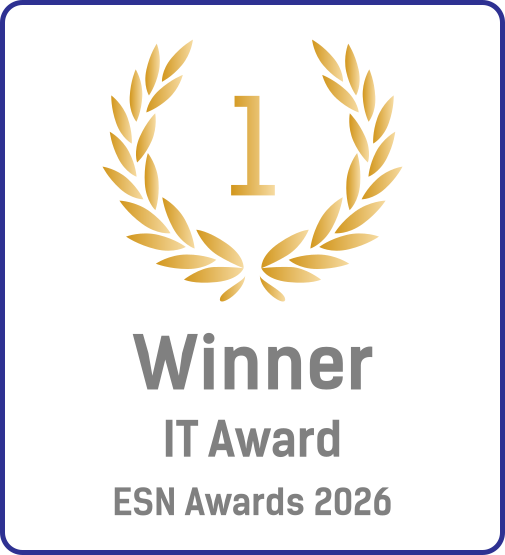

<h1 align="center">
     
    ESN Membership Manager
</h1>

ESN Membership Manager is a robust Drupal module designed to streamline the management of memberships within the Erasmus
Student Network (ESN). It provides a comprehensive framework for handling submissions for both Free Passes and ESNcards,
integrating seamlessly with your existing Drupal infrastructure.

## Features

- **🗂️ Membership Dashboard:** A centralized interface to filter, sort, and manage all membership applications.
- **✅ Interactive Review:** Streamlined workflow to approve or reject applications, including email notifications.
- **🎟️ Digital Free Passes:** Automatic generation of 32-character digital tokens for members, serving as a virtual
  alternative to physical cards.
- **📱 Universal Scanner:** A built-in scanning tool that validates both physical ESNcards and digital Free Passes in
  real-time.
- **🔒 Secure File Access:** Role-based access control for member documents (photos, IDs), ensuring privacy and security.
- **📂 Bulk Operations:** efficient management of multiple records simultaneously via Views Bulk Operations.
- **⚙️ Flexible Configuration:** deeply customizable settings to adapt to the specific needs of your ESN section.

### Integrations

- **💳 Payment Integration:** Seamless connection with [Stripe](https://stripe.com) for secure processing of ESNcard
  payments.
- **🎫 Weeztix Integration:** Connects with [Weeztix](https://weeztix.com/) to add ESNcards as promo codes for automatic
  discounts to holders.
- **👛 Google Wallet Integration:** Allows users to add their ESNcard or Free Pass to
  their [Google Wallet](https://developers.google.com/wallet) for easy access.
- **🍎 Apple Wallet Integration:** Enables iOS users to save their ESNcard or Free Pass to
  the [Apple Wallet](https://developer.apple.com/apple-wallet/).
- **📝 Google Sheets Integration:** Leverages the Google Sheets API to all paid for ESNcards to a spreadsheet in order to
  help integrate physical and online sales.

## Free Passes

The **Free Pass** system allows members to be verified for local events.

- **What is it?** A unique, 32-character hexadecimal token assigned to eligible members.
- **How it works:**
    - When an application is approved, a Free Pass token is automatically generated.
    - The token acts as a "virtual card" stored in the system.
- **Usage:**
    - Members can present their Free Pass (e.g., via QR code or digital wallet if implemented) at events.
    - The **Scanner** feature in this module (`/memberships/scan`) accepts these tokens just like physical ESNcard
      numbers.
    - Scanning a Free Pass validates the member's status and updates their "last scanned" date, ensuring active
      participation tracking and avoiding double scanning.

## Configuration

Navigate to the module configuration page (`/admin/config/system/esn_membership_manager`) to set up API keys for Stripe.

## Minimum Requirements

- PHP: 8.2
- Drupal: 10
- A Stripe account

## Dependencies

- **[Drupal Core](https://www.drupal.org/):** ^10
- **[Drupal Simple Auth](https://www.drupal.org/project/simple_oauth):** ^6.1
- **[Stripe PHP](https://github.com/stripe/stripe-php):** ^19.3
- **[Google Auth](https://github.com/googleapis/google-auth-library-php):** ^1.50
- **[Google API Client](https://github.com/googleapis/google-api-php-client):** ^2.19
- **[PKPass](https://github.com/tschoffelen/php-pkpass):** ^2.5.1

## License

This project is under the [Apache 2.0](./LICENSE) License.